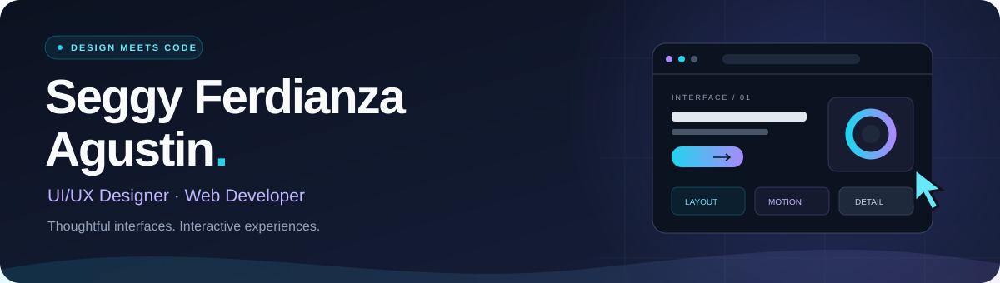

## Selected websites

| Project | Focus | Explore |
| :-- | :-- | :-- |
| **EGZ studio** | Gesture-controlled effects, air painting and photobooth strips | [Website](https://egz-gesture-studio.netlify.app) · [Source](https://github.com/EGYYFZA/hand-touch-design) |
| **Explore Nusantara** | Indonesian regions, interactive terrain and local photography | [Website](https://explore-nusantara-indonesia.vercel.app) · [Source](https://github.com/EGYYFZA/Explore-nusantara) |
| **Magna Care** | A skincare storefront with a 3D product ring and local shopping bag | [Website](https://magna-care-one.vercel.app) · [Source](https://github.com/EGYYFZA/magna-care) |

## Interface studies

| Project | Focus |
| :-- | :-- |
| [Sela House](https://github.com/EGYYFZA/Room-Explorer) | A fictional hotel with horizontal navigation and room exploration |
| [DataHub](https://github.com/EGYYFZA/ecommerce-datahub) | A local internet-package storefront and simulated customer workflows |
| [Buseet](https://github.com/EGYYFZA/bus-ticket-booking) | A static bus-ticket booking interface |
| [Perpustakaan](https://github.com/EGYYFZA/perpustakaan) | An early React/Vite library-app scaffold |

## Research and data

[HoaxShield](https://github.com/EGYYFZA/multimodal-cnn-ocr) combines CNN classification,
OCR and reference-article matching in a local research prototype.
[Kompas News Collector](https://github.com/EGYYFZA/scrape-kompas) and
[TurnBackHoax Collector](https://github.com/EGYYFZA/scrape-turnbackhoax) support work
with Indonesian news datasets. Predictions and collected content require
independent review; project READMEs describe the boundaries.

## Languages, frameworks & tools

**Languages**

**Frameworks**

**Tools & platforms**

**AI Automation**

  
  
  
  
  

**AI Automation**

  
  
  
  
  

[Connect on LinkedIn](https://www.linkedin.com/in/seggy-ferdianza-agustin-278ab9241/)
· [Browse all repositories](https://github.com/EGYYFZA?tab=repositories)
